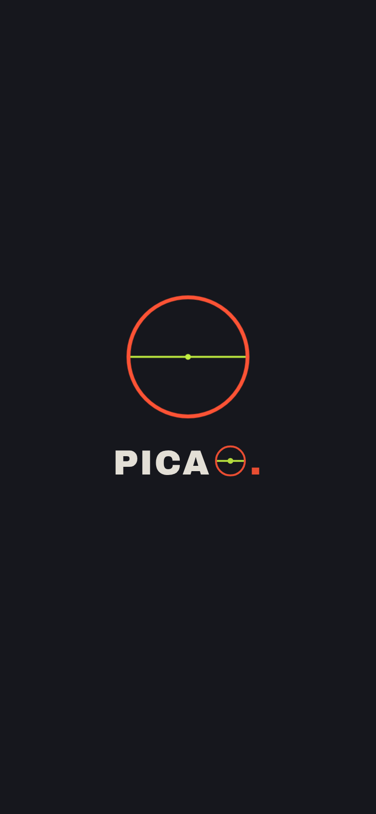
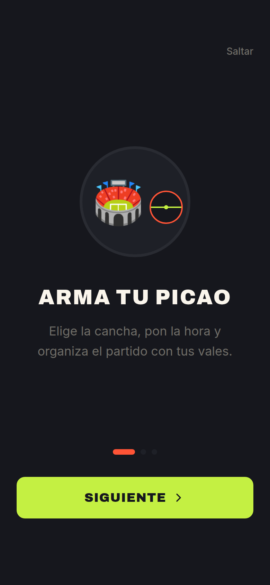
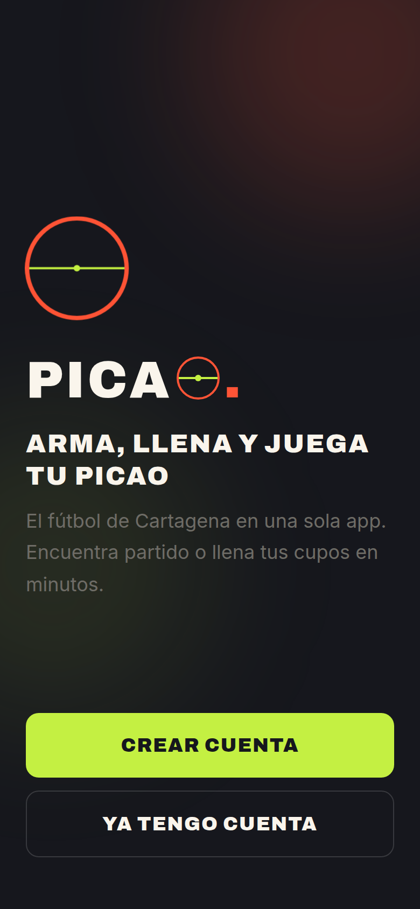
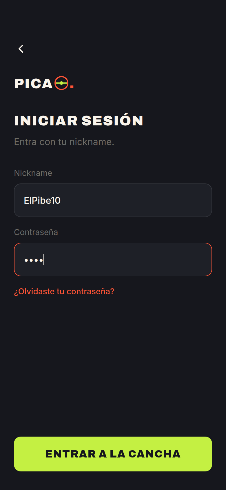
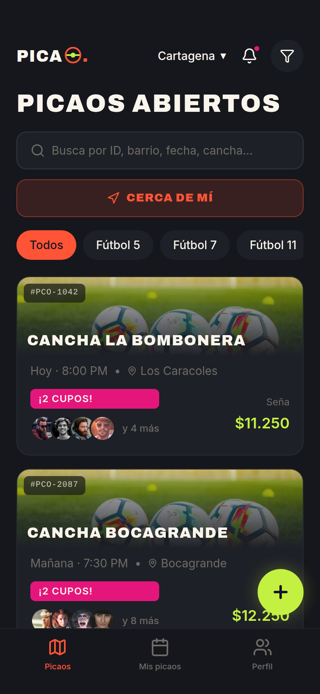
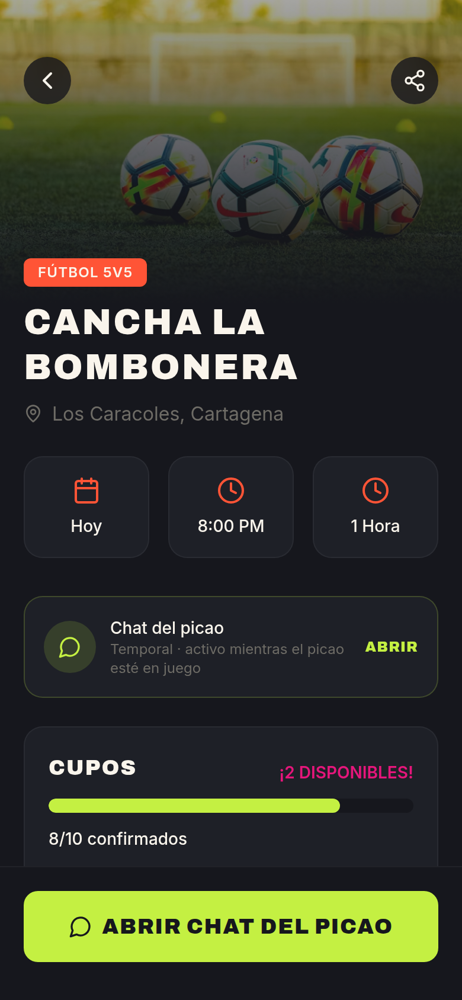
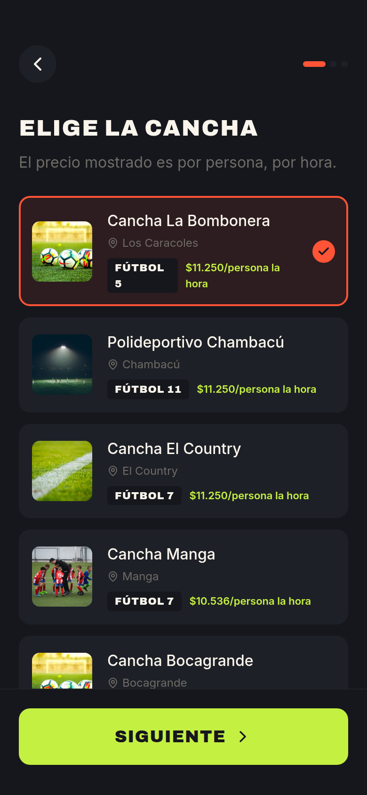
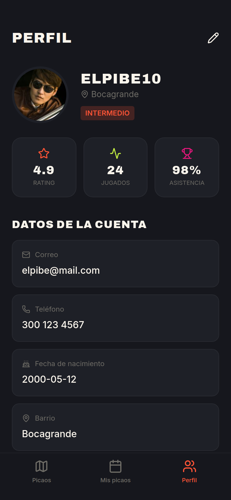
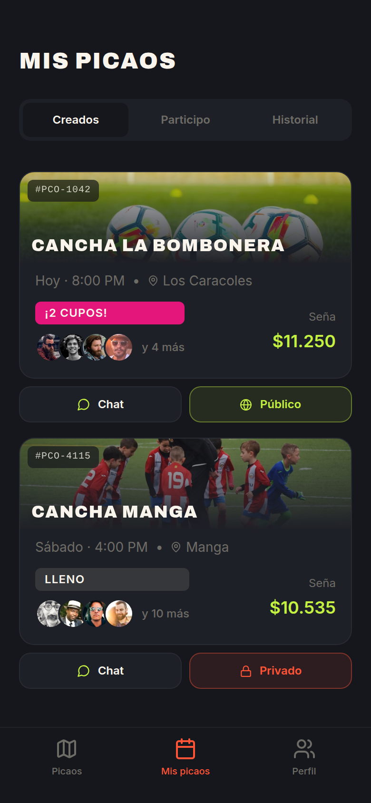
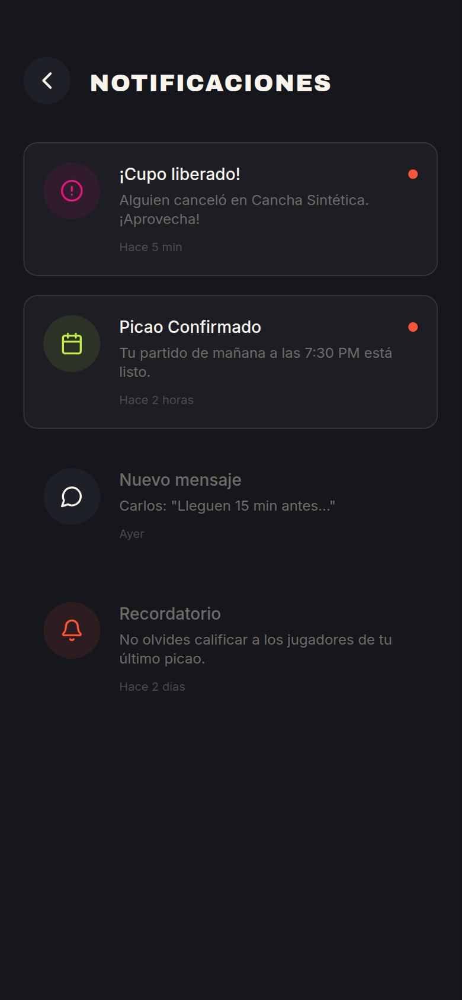

# PICAO ⚽

App móvil **hiperlocal** para **organizar y llenar partidos de fútbol amateur** ("picaos")
en Cartagena, Colombia.

> El problema que resolvemos NO es reservar canchas (mercado copado y de bajo margen):
> es **llenar el partido** — el *matchmaking* y armado del grupo de jugadores. Esa capa
> social es lo defensible. La cuña geográfica es la costa Caribe.

Construida como **PWA** (instalable desde el celular, sin tienda de apps al inicio).

---

## 📸 Capturas

| Splash | Onboarding | Welcome | Login |
|:---:|:---:|:---:|:---:|
|  |  |  |  |

| Home / Picaos | Detalle | Crear Picao | Perfil |
|:---:|:---:|:---:|:---:|
|  |  |  |  |

| Mis Picaos | Notificaciones |
|:---:|:---:|
|  |  |

---

## ✅ Lo que hay hecho hasta ahora

Esta fase es el **scaffold + el frontend visual completo**, portado 1:1 desde el
prototipo de Magic Patterns. Todavía **sin lógica de datos, auth ni pagos**.

- **Scaffold Next.js (PWA):** Next.js 15 + React 18, App Router, TypeScript, carpeta `src/`.
- **Sistema de diseño en Tailwind v3** con los tokens de marca:
  - Naranja Brasa `#FF5436` · Carbón Cancha `#16171D` · Verde Eléctrico `#C4F042`
    · Magenta Bugambilia `#E5167B` · Crema `#FAF5EC`.
  - Tipografías: **Archivo** (display, mayúsculas) e **Inter** (cuerpo) vía `next/font`.
- **Shell móvil full-screen** + **bottom nav de 3 tabs** (Picaos · Mis picaos · Perfil).
- **14 pantallas** portadas tal cual del prototipo, con navegación por **máquina de
  estados** (`history` + `framer-motion`): Splash, Onboarding, Welcome, Login, Register
  (3 pasos), Home, Detalle, Pago, Confirmado, Mis Picaos, Chat, Perfil, Notificaciones,
  Crear Picao.
- **Capa PWA:** `manifest.webmanifest`, ícono O-cancha (SVG) y service worker mínimo
  para que sea instalable.
- Datos de ejemplo (*mocks*) en `src/data/picaos.ts` para poblar las pantallas.

> ⚠️ Por ahora la navegación es una máquina de estados (igual al prototipo). Se migrará
> a rutas reales de App Router cuando se cablee la lógica de datos.

---

## 🧱 Stack

| Capa | Tecnología |
|---|---|
| Frontend | Next.js 15 (App Router) · React 18 · TypeScript · PWA |
| Estilos | Tailwind CSS v3 · `next/font` (Archivo + Inter) |
| Animación | framer-motion |
| Íconos | lucide-react |
| Backend *(pendiente)* | Supabase — auth OTP (SMS), Postgres, realtime |
| Pagos *(pendiente)* | Wompi — Nequi, Daviplata, PSE |

---

## 🚀 Cómo correrlo

Requisitos: Node 18+ y npm.

```bash
npm install
npm run dev          # http://localhost:3000
```

Otros comandos:

```bash
npm run build        # build de producción
npm start            # sirve el build de producción
npm run lint         # ESLint
```

Para probarla como móvil: abre `http://localhost:3000` y activa la vista responsive
del navegador (DevTools). El flujo central es:
**Crear Picao → Detalle → Unirse y pagar (Pago) → Confirmado**.

---

## 📁 Estructura

```
src/
├── app/
│   ├── layout.tsx        # fuentes, metadata, theme-color, registro del SW
│   ├── page.tsx          # máquina de estados de navegación (client)
│   ├── manifest.ts       # manifest PWA
│   └── globals.css       # Tailwind + utilidades (.font-display, .hide-scrollbar)
├── components/
│   ├── Shared.tsx         # logo O-cancha, FieldCard, AvatarStack, BottomNav
│   └── ServiceWorkerRegister.tsx
├── data/picaos.ts         # tipos + datos mock
└── screens/               # las 14 pantallas
public/
├── icon.svg · icon-maskable.svg · sw.js
docs/screenshots/          # capturas usadas en este README
```

---

## 🔭 Trabajo futuro

Orden de construcción planeado (por capas, una a la vez):

1. **Auth con Supabase** — OTP por SMS (Welcome / Register / Login reales).
2. **Modelo de datos en Supabase** — tablas (`usuarios`, `picaos`, `inscripciones`,
   `pagos`, `posiciones` precargadas) y migrar la navegación a **rutas reales**.
3. **Loop central con datos reales** — Crear Picao genera código `PCO-XXXX`, listado
   y búsqueda, detalle.
4. **Pagos con Wompi** — seña agrupada en una sola transacción
   (`precio_cancha / cupos + $1.250` de organización), confirmación automática al
   llenarse y **devolución** si no se llena.
5. **Realtime** — cupos en vivo, luego **Chat** y **Notificaciones** funcionales.
6. **Deploy.**

Modelo de negocio (para priorizar features):
- **Capa 1 — Señas:** depósito por jugador que confirma asistencia y elimina los *no-show*.
- **Capa 2 — Torneos y patrocinios de barrio:** el motor de margen real (a validar).
- **Capa 3 — Suscripción premium** (ELO, estadísticas): fase futura.

---

*Side project de 3 co-fundadores. Producto en español (Colombia), tono costeño y cercano.*
